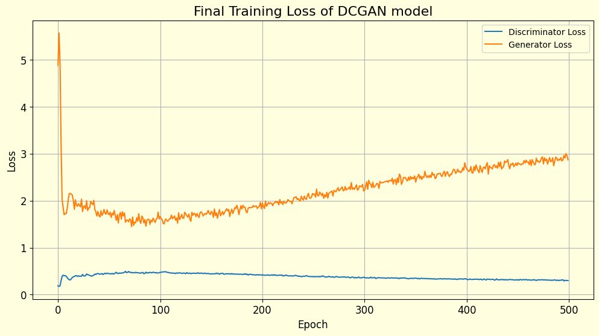
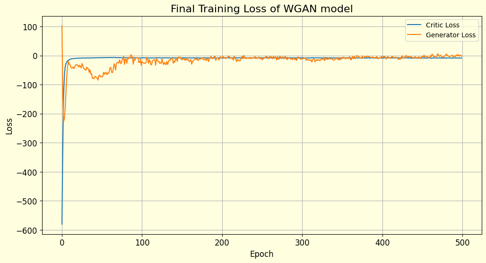
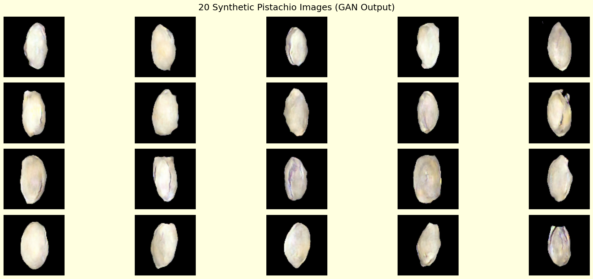
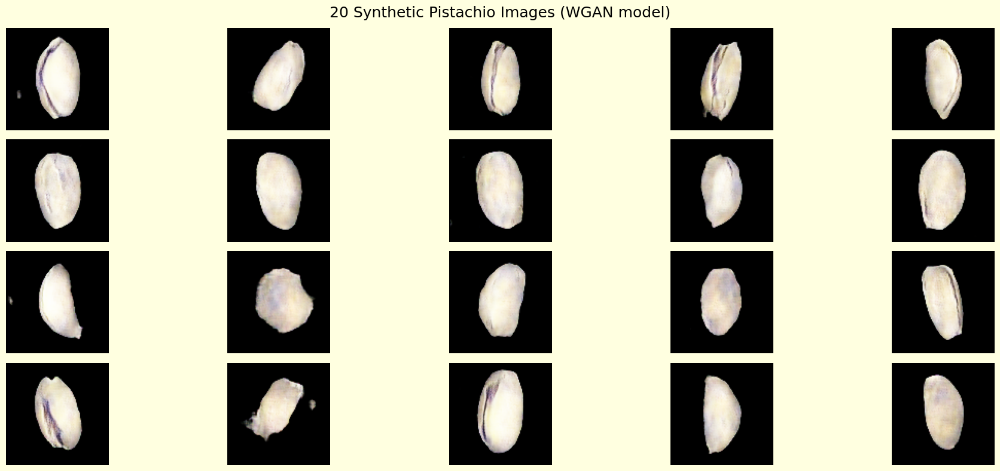

In case the notebook can't be opened on github, feel free to view it in Colab :
[Open Colab](https://colab.research.google.com/drive/1fWZmr_kU67mmXuQGH0Xis9fMlUqeDsQ3?usp=sharing)

# 🥜 Implementation of DC-GAN and WGAN for Pistachios Image Generation

This project explores Generative Adversarial Networks (GANs) to synthesize realistic pistachio images that can enrich downstream tasks like classification, object detection, and other computer vision applications.

In this notebook you will see 2 implementation of different GAN approaches:
1. Deep Convolutional GAN (DC-GAN) 
A comvolution based generative adversarial network for image synthesis, built based on generator and discriminator which will judge generator's image generation by binary classification

2. Wassertein GAN with Gradient Penalty
Improved gan variant for more stable training, changing discriminator to critic which instead of classifying the images into real or fake, it gives score to the generator's image generation, better score meaning that the critics think that the image generated is more likely to be real

# 👷‍♂️ Architecture
## DCGAN 
1. Generator:
- Dense → reshape into feature maps (28x28x64).
- Progressive upsampling + conv blocks until reaching 100x100x3.
- BatchNorm + ReLU activations for stability.
- Final tanh activation for pixel values in [-1,1].

2. Discriminator:
- 3 convolutional layers with ReLU + Dropout.
- Final Dense output with Sigmoid for real/fake classification.
- Uses label smoothing (real=0.9) to stabilize training.

👉 Training alternates multiple discriminator steps per generator step.

## WGAN-GP
1. Generator:
- Dense → reshape into 25x25x128.
- Two upsampling blocks → final 100x100x3 image.
- Conv blocks with BatchNorm + ReLU.
- Output with tanh in [-1,1].

2. Critic:
- 4 convolutional layers with LeakyReLU.
- Linear output (no sigmoid).

3. Training tricks:
- Gradient penalty enforces Lipschitz constraint.
- Multiple critic updates per generator update (critic_steps=5).
- Exponential Moving Average (EMA) for smoother generator updates.

👉 Produces more stable training and higher-quality pistachio images compared to vanilla GAN/DCGAN.

# 💡 Results:
## Loss PLot
- DCGAN : Unstable, oscillating, prone to mode collapse.
- WGAN - GP : Smooth, interpretable, “healthy fight” between generator & critic.

## Sample Outputs

# 🏆 Quantitative Evaluation (FID)
To provide a definitive and accurate quantitative measurement for both of the model, Frechet Inception Distance is used and we got the score of 

| Model    | FID Score | Notes                                                                 |
|----------|-----------|----------------------------------------------------------------------|
| **DCGAN**   | **145.8**   | Achieved via a “lucky checkpoint” but training was unstable (mode collapse risk). |
| **WGAN-GP** | **145.6**   | Achieved consistently with stable training and more diverse outputs. |

This might seems just a little bit different from both of the model, However from both of the model we can't just look at the FID number, but we have to see the process too.
- `DCGAN-The Baseline` : The FID score of 145.8 for the DCGAN represents a "lucky punch" from a chaotic and unstable training process. As evidenced by the erratic loss curves, the DCGAN model was constantly on the verge of either mode collapse or training divergence. This score is achieved by picking a single checkpoint where the model was at the best performance, before the generator keep losing as we can see at the plot of loss. The training is also unstable. Influencing the decision to try a different model, which is WGAN-GP.
- `WGAN-GP > The modified` : With the FID of 145.6, This result was achieved from a model whose training was healthy, stable, and predictable from start to finish, as proven by its loss curve that is stable and we can see a visible "fight" between the generator and discriminator. The generator is able to generate a more variation of nut shapes more than the DC-GAN meaning that the model has successfully learned more from the previous model

# ✅ The success of this project is threefold:

- Qualitative Success: A visual analysis of the generated images proves that the WGAN-GP successfully solved the model collapse problem. It produced a more diveresed outputs, exploring various shapes, orientations, and features present in the dataset like opened nut, something that DCGAN cannot achieve

- Training Process Success: A comparison of the loss curves demonstrates a dramatic improvement. The unstable behavior of the DCGAN was replaced by the stable, interpretable, and healthy training dynamic of the WGAN-GP. This proves the modification created a reliable and predictable process

- Quantitative Success: The final FID scores confirm the efficacy of the new model. The WGAN-GP achieved a score of 145.6, proving it could match the quality of the DCGAN's best possible "lucky shot" (145.8) but through a stable and trustworthy method instead of just luck from DC-GAN with unstable model training process.

